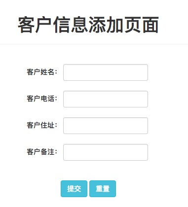
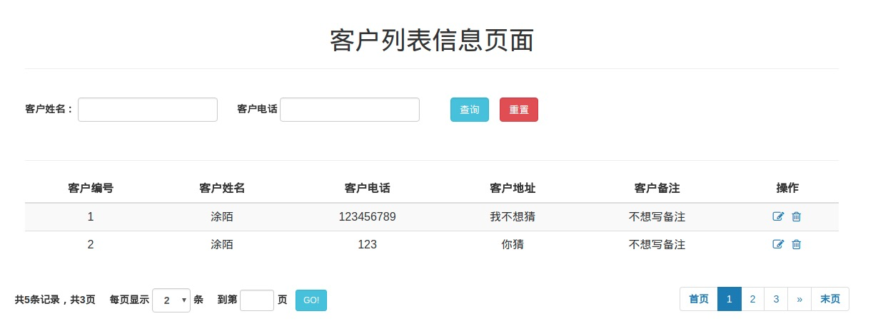
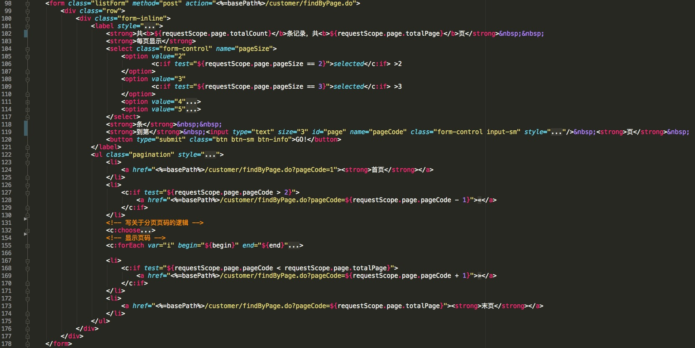
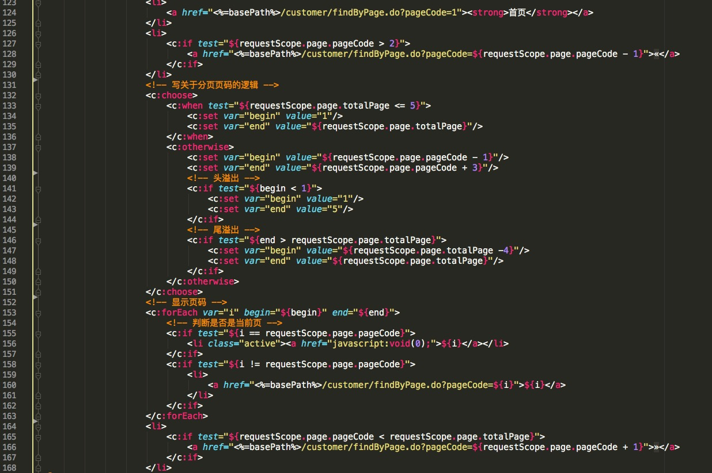

# 关于项目

## 测试环境

```
后端：spring+mybatis+springmvc 
前端：bootstrap+Font Awesome图标集
测试环境：IDEA + tomcat8 + mysql5.7 + jdk8 + maven
```

## 项目功能
```
1. 实现用户登录功能
2. 实现客户信息的增删改查功能
3. 实现分页查询功能（使用PageHelper分页插件实现）
```

## 项目结构

```
.
├── README.md 
├── img  -- 放了一些README.md文档所需要的图片，没有实际意义
├── pom.xml
└── src
    └── main
        ├── java
        │   └── cn
        │       └── tycoding
        │           ├── controller  -- SpringMVC-WEB层控制器
        │           ├── mapper  -- Mybatis接口和映射文件。本项目采用了mybatis的接口开发，所以接口和映射文件放在同一目录下，并且名称相同。
        │           ├── pojo  -- JavaBean实体类
        │           └── service  -- service业务层
        ├── resources  -- maven项目存放配置文件的根目录(classpath:)
        │   ├── sys_schema.sql  -- 项目数据库创建和表创建的SQL语句
        │   ├── resource  -- 日志打印和数据源配置文件
        │   └── spring  -- spring和springmvc的配置文件
        └── webapp  -- 项目的根目录
            ├── WEB-INF
            ├── fonts  -- 字体的配置文件
            └── lib  -- 前端静态资源
```

## 整合思路
继上一篇博文：[Spring MVC起步](http://tycoding.cn/2018/05/29/Spring-5/)其实我们已经了解了如何整合Spring和Spring MVC框架。那么，接下来我们就需要了解如何在此基础上整合Mybatis框架。
首先须知Mybatis框架是一个持久层框架，而Spring MVC是WEB层框架，Spring框架则充当着业务层的角色。那么将三者联系起来正好组成了`web--service--dao`的三层架构体系。那么整合思路就如下所示了：
    
1. 整合dao(即mapper)，实现Mybatis和Spring的整合
2. 整合service，由Spring管理service接口，在service中可以调用dao（mapper）
3. 整合web（controller），实现Spring MVC和Spring的整合，在controller中调用service


# 需求实现

## 1. 实现用户登录功能

### 1.1 创建表结构

SQL语句请查看GitHub中resources目录下的.sql文件
除了创建表，我们同样要创建`pojo`对象，并提供属性setter和getter方法。（注意尽量保持`pojo`属性参数和表字段名称对应相等）

### 1.2 编写Controller层

```java
@RequestMapping(value = "/login")
public String login(@RequestParam String username,@RequestParam String password, Model model) {
    User user = userService.login(username);
    if (user != null) {
        if (user.getPassword().equals(password)) {
            //登录成功
            return "page/page";
        } else {
            model.addAttribute("message", "登录失败");
            return "page/loginInfo";
        }
    } else {
        model.addAttribute("message", "你输入的用户名或密码有误");
        return "page/loginInfo";
    }
}
```

**注意**

* `@RequestMapping`标注`login()`方法有两个作用（前提是必须在XML中开启注解扫描`<context:component-scan/>`）：1.表示该方法是请求处理方法；2.指明了该方法的请求路径。

* `@RequestMapping`可以标记类或方法，分别表示了不同层级的请求路径。例如当前的`login()`方法的请求路径应为：`localhost:8080/xxx/login.do`（需要注意的是：本例中使用了IDEA开发工具，访问其部署到Tomcat上的项目默认是不加项目名的，但是使用eclipse访问项目可能默认需要加上项目名，具体要看实际开发工具中对Tomcat的配置）

* 对于请求体中包含多个参数的情况，我们尽量用`@RequestParam`注解标记参数，以免出现未知错误（但这不是必须的）。`@RequestParam`注解能帮助识别请求体中的参数，比如请求体中传递的参数名是`id`，但是你用`int uid`接收就可能会报错400（请求参数错误），这时我们使用`@RequestParam("id")`就能帮助Spring装配这个参数。

用户登录，我们首先获取到用户登录的用户名`username`和密码`password`，然后根据用户名查询并返回，根据此用户名查询到的密码与登录的密码进行`equals`，如果相等就登录成功。（当然我们要判断根据`username`查询后的返回值是否为null，不做判断会产生空指针问题，如果一个空值和另一个值相比显然会报错）。
如果登录成功，将返回到`page/page.jsp`页面（这是根据我们在`springmvc.xml`下配置的视图解析器`InternalResourceViewResolver`决定的）;如果登录失败将返回到`page/loginInfo.jsp`页面。比如本项目中配置的视图解析器：

```xml
<bean class="org.springframework.web.servlet.view.InternalResourceViewResolver">
	<property name="prefix" value="/WEB-INF/"/>
	<property name="suffix" value=".jsp"/>
</bean>
```
只要在SpringMVC的配置文件中配置了这个选项，SpringMVC就默认匹配Controller层（用@Controller标识的类）中返回值为String类型的映射方法中`return`的数据和`webapps/WEB-INF/xx.jsp`中JSP页面的文件名，映射方法（用@RequestMapping标识的方法）`return`的值和`/WEB-INF/`下某个JSP页面文件名相同就跳转到这个页面，否者就报错404。当然除了使用`@ResponseBody`标识的方法和`@RestController`标识的类，因为这两个注解会将其下的方法返回值都转换为JSON
格式的数据，并且不会被`InternalResourceViewResolver`识别。

### 1.3 编写Mapper.xml

```xml
<select id="login" parameterType="String" resultType="User">
    select * from user where username = #{username}
</select>
```

我们使用了Mybatis的接口代理开发模式（保证接口和配置文件在同一目录下且名称相同），直接在`Mapper.xml`中编写原生sql语句，即可进行与数据库间的交互。其中：

* `id`指明是哪个方法调用这个sql；

* `parameterType`指定了接口传递的参数类型(我们根据用户名查询所以是String类型)；

* `resultType`指定该查询语句返回值的数据类型（因为我们已经在配置文件启用了别名配置`typeAliases`，所以这里直接指定pojo对象类名即可；若没有启动别名配置，就必须写类的全限定名）。使用`#{}`会将传递的参数值会自动添加`""`；注意`#{}`和`${}`区分，后者则是直接拼接传递进来的字符串，而不会添加任何符号，且前者能避免sql注入。


## 2. 实现客户信息的添加

所谓添加客户信息，就是将JSP中提交的表单数据持久化到数据库中。

### 2.1 创建表结构

建表SQL请看github项目中的resources目录下的.sql文件
同样我们还要创建对应的`pojo`，并提供getter和setter方法。（尽量保持`pojo`中的元素属性名称和表中字段名称相同）。

### 2.2 编写Controller层

```java
@RequestMapping(value = "/save")
public String save(Customer customer, Model model) {
    customerService.save(customer);
    model.addAttribute("message", "保存客户信息系成功");
    return "page/info";
}
```




当点击了提交按钮，表单中的所有数据都应该被持久化到数据库中，而要知道表单中的参数有很多，我们直接在请求映射方法的参数列表中写参数显然是不可取的，那么我们如果写一个pojo对象，Spring就会根据这个pojo对象中的属性和JSP表单中的参数进行对应，如果完全对应那么请求方法会正常执行，一但有某个参数不对应，那么就会报错。（注意我们表单中并不需要指定`id`主键值，因为设计表时已经指定了该`id`主键为自增长，即使不指定值，`id`依然会自增，你指定了却可能会产生错误，因为到保证每次的`id`值都是递增的）。当数据持久化成功，就使用Spring的`Model`对象在域对象中设置一个名为`message`的值。最后再返回到视图层。

### 2.3 编写Mapper.xml
```xml
<insert id="save" parameterType="Customer">
        insert into
        customer(
          name,
          telephone,
          address,
          remark)
        values(
          #{name},
          #{telephone},
          #{address},
          #{remark}
        );
</insert>
```

如上这仍然是普通的SQL语句，注意`parameterType`如上我们设置为`Customer`其实代表的是`cn.tycoding.pojo.Customer`这个对象，因为我们已经在`beans.xml`中启用了mybatis的别名配置。SQL插入语句中不需要指定`id`这个字段，原因是我们已经配置了`id`为自增主键


## 3. 实现客户信息的删除功能

### 3.1 编写Controller层

```java
@RequestMapping(value="/delete")
public String delete(@RequestParam int id,Model model){
    if(customerService.delete(id) > 0){
        model.addAttribute("message","删除客户信息成功");
        return "page/info";
    }else{
        model.addAttribute("message","删除客户信息失败");
        return "page/info";
    }
}
```

删除功能只需要根据点击删除按钮时获取到的`id`值，在SQL的`delete`语句中`where`这个id值，即可以实现根据id删除客户信息。

### 3.2 编写Mapper.xml

```xml
<delete id="delete" parameterType="int">
    delete from customer where id = #{id}
</delete>
```

如此，还是一个再普通不过的SQL语句，既可以实现根据id删除的功能。


## 4. 更新客户信息

更新客户信息需要我们实现两个功能：1.再点击*编辑*按钮时(我们在按钮设置了`onclick="return edit(${xx.id};"`)，如此我们用js监听这个事件，点击了按钮，js获取到id，请求后台根据这个id值查询数据库中的数据。那么我们先看一下js部分吧：

```javascript
function edit(id){
  $.ajax({
    url: 'xxx/findById.do',
    type: 'POST',
    dataType: 'json',
    contentType: 'application/json;charset=UTF-8',
    data: JSON.stringify({id: id}),
    success: function(result){
      $("#username").val(result.username);
      $("#password").val(result.password);
      //继续讲查询到的字段依次进行赋值...
    }
  });
}
```

以上实际是一个ajax请求json格式数据：

1. `type`指定请求类型；

2. `dataType`指定了服务器返回数据格式类型；

3. `contentType`指定发送给服务器的数据格式，默认是`application/x-www-form-urlencoded`会使此时的`data`参数为JSON对象，而设置为`application/json`后此时的`data`参数就是json字符串了，同样使用`stringify()`也是将`data`参数转换成json字符串。

### 4.1 编写Controller层

```java
@ResponseBody
@RequestMapping(value="/findById")
public Customer findById(@RequestBody Customer customer){
    Customer customer_info = customerService.findById(customer.getId());
    if(customer_info != null){
        return customer_info;
    }else{
        return null;
    }
}
```

* `@RequestBody`读取http请求内容，并将数据绑定在映射方法的参数上；
* `@ResponseBody`将映射需要返回的参数转换成指定的数据格式，而由于我们在ajax请求中指定`dataType`为`json`，那么`@ReqponseBody`将会返回json格式数据。

当ajax请求了这个映射方法，Controller获取到指定的id去调用Service层根据这个id查询数据库`select * from customer where id = #{id}`。然后将数据拼装成JSON格式，并返回给页面。最后ajax会走success方法，我们从返回的数据`success:function(result)`中通过`result.xx`的方式取出来并通过jquery的`val()`方式赋值到指定的位置，那么就实现了数据回显。
实现修改功能，首先要知道原本的数据（数据回显），然后将修改后的数据在此存入到数据库中（`update customer set xx=#{xx} where id = #{id}`。那么我们看一下，更新数据库的Controller：

```java
@RequestMapping(value="/update")
public String update(Customer customer,Model model){
    int rows = customerService.update(customer);
    if(rows > 0){
        model.addAttribute("message","更新客户信息成功");
        return "page/info";
    }else{
        model.addAttribute("message","更新客户信息失败");
        return "page/info";
    }
}
```

因为更新数据其实就是简单的提交表单，表单提交后访问这个映射方法，指定对应的`update`语句，如果没有异常抛出就更新成功，通过SpringMVC的Model方法向request域对象中存入成功信息，在返回的页面中，通过`${message}`EL表达式的方式取出提示信息。

最后我们看一下更新的SQL如何写：

### 4.2 编写Mapper.xml

```xml
<!-- 更新客户信息的方法 -->
<update id="update" parameterType="Customer">
    update customer set
        id = #{id},
        name = #{name},
        telephone = #{telephone},
        address = #{address},
        remark = #{remark}
    where id = #{id}
</update>
```


## 5. 分页查询

我们先看一下前端Bootstrap的分页效果



### 5.1 封装PageBean

这里我们使用Mybatis的分页查询插件：PageHelper。

> 1.首先引入maven依赖：

```xml
<dependency>
    <groupId>com.github.pagehelper</groupId>
    <artifactId>pagehelper</artifactId>
    <version>4.0.0</version>
</dependency>
```

> 2.定义一个PageBean，非必要，但是提取通用的PageBean实体类对象用来储存分页数据，能提高代码的重用率。

**虽然**我们这里使用了PageHelper分页插件，但是请弄清楚：pageHelper只是帮我们进行后端的数据分页，也就是说使用了PageHelper插件我们无需再写类似 `limit`这样的sql了。

而，我们的数据最终要显示到前端页面上，此时我们使用的bootstrap和javascript技术并不能实现前端分页自动计算，所以前端我们还是需要手动计算分页数据。

那么PageBean的定义不变：

```java
public class PageBean<T> implements Serializable {
    //当前页
    private int pageCode;

    //总页数=总记录数/每页显示的记录数
    private int totalPage;

    //总记录数
    private int totalCount;

    //每页显示的记录数
    private int pageSize;

    //每页显示的数据
    private List<T> beanList;
}
```

因为我们要实现分页查询，所以无法避免一些参数，这里直接将其封装为一个JavaBean就是为了方便调用，而配置自定义泛型`<T>`就是为了供多个对象的调用，如果你在对Customer类进行分页查询，那么在调用时只需要`new pageBean<Customer>()`即可将查询的数据绑定为`Customer`类的数据；对其他类进行分页亦是这样。

* **pageCode:** 表示当前（你点击）的是第几页。

* **totalPage:** 表示总页数（总页数=总记录数/每页显示的记录数）。通过`select count(*) from 表`查询到总记录数，每页显示的记录是用户指定的；那么*总记录数/每页显示几条记录*就得到了一共有几页（前端页面展示）。

* **totalCount:** 表示总记录数，由SQL：`select count(*) from 表`查询到该表咋数据库中一共多少条记录数。

* **pageSize:** 表示每页显示的记录数，这个是用户决定的，比如我们想让每页显示5条数据，那么这个`pageSize`就应该是5，即每页会显示5条记录。

* **beanList:** 表示当前显示的数据。经上面的一系列查询和封装，我们最终需要将数据返回给页面，而这些需要返回给页面的数据最终会被封装到这个`beanList`中，在jsp中使用`<forEach>`标签遍历`beanList`得到封装的数据并显示到页面上。


### 5.2 jsp页面

由于我们前端仅使用了最基本的JavaScript和Bootstrap框架，很多特性都不能使用，所以这里用最基本的方式来实现前端的分页。当然以后我们学习了Vue.js, Angular.js, node.js这些高级JS语言后，就会发现前端数据渲染是如此的简单。



### 5.3 编写Controller层

```java
@RequestMapping("/findByPage")
public String findByPage(Customer customer,
                         @RequestParam(value = "pageCode", required = false, defaultValue = "1") int pageCode,
                         @RequestParam(value = "pageSize", required = false, defaultValue = "2") int pageSize,
                         Model model) {
    // 回显数据
    model.addAttribute("page", customerService.findByPage(customer, pageCode, pageSize));
    return "page/list";
}
```
对比上面两张图，发现，用户可以指定的就是`pageCode`当前页和`pageSize`每页显示的记录数。所以在点击按钮（比如点击页码`3`），就会提交表单并访问Controller的`findByPage()`方法。
那么Controller就需要接受这两个参数:`pageCode`and`pageSize`，并且我们设置:`defaultValue`默认值；`required`是否必须指定（如果没有写false，在每次请求这个方法时就必须指定这个参数的具体值，不然就会报错）。
方法体中我们还通过`request`域获取`c_name`和`c_telephone`（因为要实现条件查询：输入信息，查询数据）。
最后我们将这些查询条件封装到Map集合中，然后调用Service层，将`pageCode`和`pageSize`以及封装的查询条件信息`conMap`一同传入Service层。

那么在Controller层我们使用了一个很简便的方式：**实现分页查询和条件查询**使用同一个方法；仔细想一下也很容易明白，分页查询和条件查询目的都是要将查询到的数据以分页的方式展示出来，只是两者限制的条件不同罢了。所以我们这样定义Controller：

1. 使用`Customer`实体类接收条件查询的条件，如果进行的是分页查询`Customer`中属性值为null也无影响；前端直接将要查询的条件`name`和`telephone`传入进来，使用`Customer`可以封装，因为`name`和`telephone`都是`Customer`的参数，这是Spring的自动装配特性。

2. 使用`pageCode`和`pageSize`接收分页查询的条件，并且使用`defaultValue`设置两者的默认值，这里我们设置当前页默认为1，每页默认显示2条记录。

3. 使用Model对象将查询到的数据封装进去，相当于存进了Request域对象中，JSP页面使用EL表达式即可取出来名字为`page`的List集合数据。

### 5.4 编写Service层

由于我们使用了Mybatis的PageHelper分页插件，所以无需手动计算分页数据，也不用编写`limit`类似的SQL语句。

**之前**

未使用PageHelper分页插件前我们这样定义Service层：

```java
public PageBean<Customer> findByPage(int pageCode, int pageSize, Map<String, Object> conMap) {
        HashMap<String,Object> map = new HashMap<String,Object>();
        PageBean<Customer> pageBean = new PageBean<Customer>();

        //封装当前页
        pageBean.setPageCode(pageCode);
        pageBean.setPageSize(pageSize);

        // 封装总记录数（从数据库中查询）
        int totalCount = customerMapper.selectCount();
        System.out.println("查询到的总记录数："+totalCount);
        pageBean.setTotalCount(totalCount);

        //封装总页数
        double tc = totalCount;
        Double num = Math.ceil(tc / pageSize);
        pageBean.setTotalPage(num.intValue());

        // 设置limit分页查询的起始位置和终止位置
        map.put("start",(pageCode - 1) * pageSize);
        map.put("size",pageBean.getPageSize());

        //封装每页显示的数据
        List<Customer> list = customerMapper.findByPage(map);
        pageBean.setBeanList(list);

        // 分页查询功能也要封装显示起始页和终止页
        conMap.put("start",(pageCode - 1) * pageSize);
        conMap.put("size",pageBean.getPageSize());

        // 封装
        List<Customer> listCondition = customerMapper.findCondition(conMap);
        pageBean.setBeanList(listCondition);
        return pageBean;
}
```

**解释**

作为业务层，当然负责梳理业务信息，首先我们需要将Controller传入进来的`pageCode`和`pageSize`封装进`PageBean`的相关属性中。然后查询总记录数（通过`select count(*) from 表`查询得到），根据总记录数`pageCount`和前台传入的`pageSize`每页显示的记录数计算得到总页数，同样封装到`PageBean`中，最后我们要设置分页的起始位置`start`和数量`size`，调用Mapper查询数据库中的数据，将数据封装到`beanList`中即可。但是要注意我们其实写了两个分页查询的方法：`findByPage()`和`findCondition()`因为两者都需要分页展示到页面上。最后解释两点：

1. 计算总页数：总页数 = 总记录数 / 每页显示的记录条数。这里用到的ceil()方法：返回大于或登录参数的最小double值，并等于数学整数。如double a = 5;double b = 3;ceil(a/b) = 2.0。最后用Double类的intValue()方法返回此Double值作为int类型的值。
2. mysql为分页查询提供了limit方法，limit a,b就是读取第a条到第b条的所有记录。
   设置`start`为*(当前页-1)此时每页显示的记录数*。
   设置`size`为*我们在pageBean中封装的每页显示几条记录数*。
   例如：我们目前页面每页显示2条数据，点击下一页，则显示的数据就是第`3 - 5`条。 


即要手动进行数学运算，得到分页的数据，但是你是不是也觉得这样过于麻烦？PageHelper让我们简化了分页数据的计算，我们仅需要这样定义：

```java
/**
 * 分页查询-条件查询方法
 *
 * @param customer 查询条件
 * @param pageCode 当前页
 * @param pageSize 每页的记录数
 * @return
 */
public PageBean findByPage(Customer customer, int pageCode, int pageSize) {
    //使用Mybatis分页插件
    PageHelper.startPage(pageCode, pageSize);

    //调用分页查询方法，其实就是查询所有数据，mybatis自动帮我们进行分页计算
    Page<Customer> page = customerMapper.findByPage(customer);

    return new PageBean(pageCode, (int)Math.ceil((double)(page.getTotal() / (double)pageSize)), (int)page.getTotal(), pageSize, page.getResult());
}
```

因为我们将条件查询和分页查询合为一个方法，所以这里出现三个参数。PageHelper有一个构造函数`starPage()`，将pageCode当前页和pageSize每页的记录数传入即可完成之前的一系列数学运算。

查询需要调用Mapper层的`findByPage(customer)`方法:

1. 首先需要指定Mapper层的`findByPage()`方法的返回值是Page类型，因为是PageHelper查询进行的数据分页；
2. 需要将`customer`参数传入，因为我们条件查询也调用这个方法，查询的条件就封装在Customer对象中；
3. 返回值是PageBean类型，需要调用PageBean中带参构造函数，将查询到的数据依次封装到PageBean对象中，最终返给前端JSP页面；
4. `page.getTotal()`是PageHelper提供的得到分页查询中一共多少条数据的函数；`page.getResult()`是PageHelper提供的得到具体分页数据的函数；
  
  
### 5.5 编写Mapper.xml

* 注意：这里使用了mybatis的mapper接口实现方式，再强调几个注意事项：
    1. mapper.xml文件名称必须和接口名称相同
    2. Mapper 接口方法名和 UserMapper.xml 中定义的每个 sql 的 id 同名。
    3. Mapper 接口方法的输入参数类型和 UserMapper.xml 中定义的 sql 的parameterType 类型相同。
    4. Mapper 接口的返回类型和 UserMapper.xml 中定义的 sql 的 resultType 类型相同

**未使用PageHelper分页插件**前，我们需要这样定义：

```xml
<!-- 查询总的记录数 -->
<select id="selectCount" resultType="int">
    select count(*) from customer;
</select>

<!-- 分页查询 -->
<select id="findByPage" parameterType="Map" resultMap="BaseResultMap">
    select * from customer
    <if test="start != null and size != null">
        limit #{start},#{size}
    </if>
</select>

<!-- 多条件查询 -->
<select id="findCondition" parameterType="Map" resultMap="BaseResultMap">
    <!-- where 1=1 可以保证where后的语句永远是正确的
        因为在where后的动态SQL可能会执行也可能不会不会执行，如果没有执行，那么where后将跟一个空值，那么显然这样是会报错的
    -->
    select * from customer where 1 = 1
    <if test="c_name != null and c_name != ''">
        and c_name like concat('%', #{c_name}, '%')
    </if>
    <if test="c_telephone != null and c_telephone != ''">
        and c_telephone like concat('%', #{c_telephone}, '%')
    </if>
    <!-- 我们通过在Service中的计算决定了我们每次请求的数据应该从那一页开始，那一页结束 -->
    <if test="start != null and size != null">
        limit #{start},#{size}
    </if>
</select>
```

注意几点：

1. findByPage方法是用来分页显示数据的，我们传进来的数据是Map集合，定义了parameType="Map"；resultMap实现了将查询到的复杂的数据映射到一个结果集中
2. findCondition方法是用来分页显示条件查询到的数据的，注意where 1 = 1主要是用来避免以下动态sql中的条件都不满足的情况时，where后就没数据了，这样显然报错，加上1=1就避免了这种情况


**使用了PageHelper分页插件**，并且将分页查询的方法和条件查询的方法合为一个，并通过Customer对象进行封装查询条件，我们只需要：

```xml
<select id="findByPage" parameterType="cn.tycoding.pojo.Customer" resultMap="BaseResultMap">
    SELECT * FROM tb_customer WHERE 1=1
    <if test="name != null">
        AND name LIKE CONCAT('%', #{name}, '%')
    </if>
    <if test="telephone != null">
        AND telephone LIKE CONCAT('%', #{telephone}, '%')
    </if>
</select>
```

这里使用了Mybatis的动态SQL语句：如果包含查询条件就执行查询方法，不包含就不执行。注意`WHERE 1=1`的巧妙用法。

## 拓展：Service层的封装

因为实际项目中肯定不会仅涉及一张表的增删改查功能，那么多次编写Service层基本增删改查的接口，代码重用率就太低了，所以我们将常用的接口方法提取出来，放到一个通用的Service层接口中。

这里需要使用泛型类`<T>`这个T就代表你的接口实现类所要使用的实体类对象：

```java
public interface BaseService<T> {

    /**
     * 查询所有
     *
     * @return
     */
    List<T> findAll();

    /**
     * 根据id查询
     *
     * @param id
     * @return
     */
    List<T> findById(Long id);

    /**
     * 新增
     *
     * @param t
     */
    void create(T t);

    /**
     * 更新
     *
     * @param t
     */
    void update(T t);

    /**
     * 删除
     *
     * @param id
     */
    void delete(Long id);
}
```

那么我们原本的CustomerService.java文件就修改为：

```java
public interface CustomerService extends BaseService<Customer> {

    /**
     * 分页查询
     * @param customer 查询条件
     * @param pageCode 当前页
     * @param pageSize 每页的记录数
     * @return
     */
    PageBean findByPage(Customer customer, int pageCode, int pageSize);
}
```

如此，即可。BaseService中存放通用的方法，每个私有的Service接口中继承这个公共接口，也可以定义自己私有的接口。

## 5.6 分页逻辑

首先我们看一下页码是如何展示出来的：



```
百度分页算法（每页显示10个页码）：
	当点击页码7之后的页码，最前端的页码依次减少
		[0] [1] [2] [3] [4] [5] [6] [7] [8] [9] [10]
		点击[7]
		[1] [2] [3] [4] [5] [6] [7] [8] [9] [10] [11]
算法：
	若 总页数 <= 10		则begin=1			  end=总页数
	若 总页数 > 10		则begin=当前页-5	  	end=当前页+4
		头溢出: 若begin < 1		 则begin=1	   end=10
		尾溢出: 若end > 总记录数   则brgin=end-9	 end=总页数	
		
此项目设置每页显示5个页码：
	若 总页数 <= 5		则begin=1			 end=总页数
	若 总页数 >  5		则begin=当前页-1	  	end=当前页+3
		头溢出: 若begin < 1		  则begin=1	   end=5
		尾溢出: 若end > 总记录数   则brgin=end-4	 end=总页数

* (end表示页面的最后一个页码，begin表示页面的第一个页码)
```


